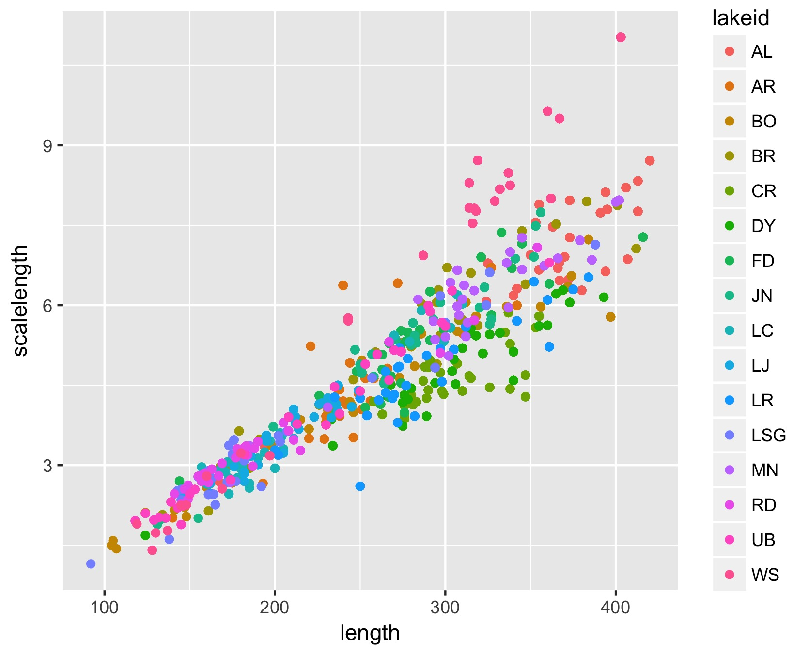
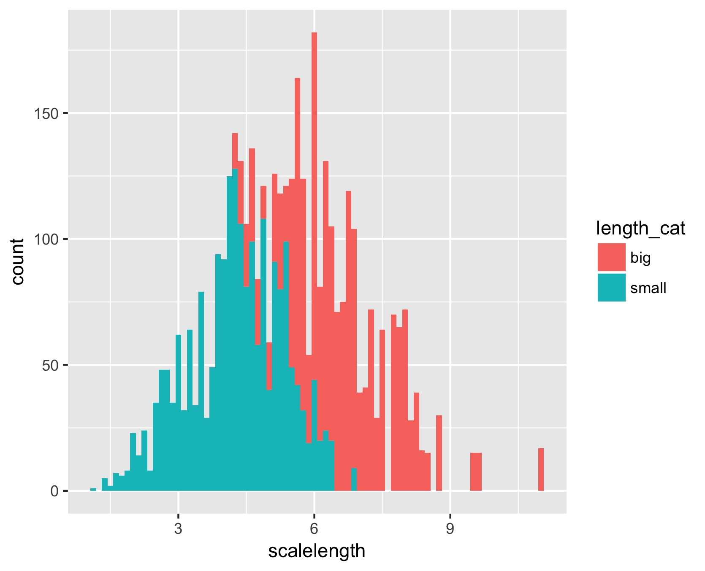

# RachelCohen_1

### Directory: "Rachel_Cohen_1.Rprog"
**scripts**
  -- "myscript.R"
  This is the assignment for week 7 that we have worked on. Connected it to GitHub and have pushed the script to the cloud so it can be edited from anywhere. Made 2 plots and they are saved in plots
  
**data**
  -- "Gaeta_etal_CLC_data_1.csv.csv"
  Data used to make our plots

**plots**
  -- 
  -- 
  Histogram with modified bin of 80 by length
  
README.md
.gitignore
  
